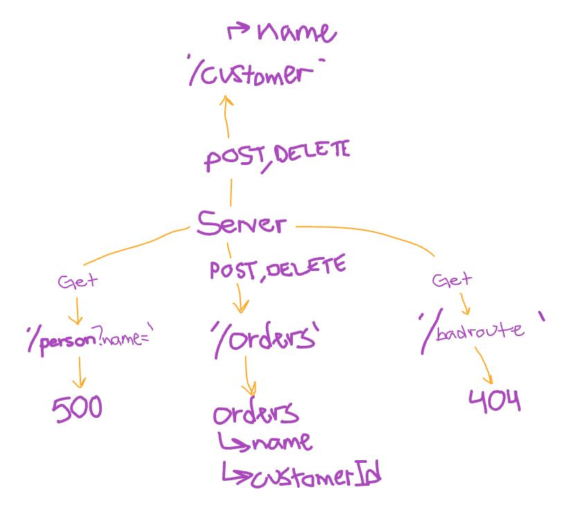

# api-server

Add Database Abstraction and Associations to your API

---

## Routes

### /customers

* No parameters
* JSON response: {"name":"value"}

### /orders
* No parameters
* JSON response: {"name":"value", "customerId":integer}

--- 

## URLs

[Deployed page here](https://timegorov-api-server.herokuapp.com)
